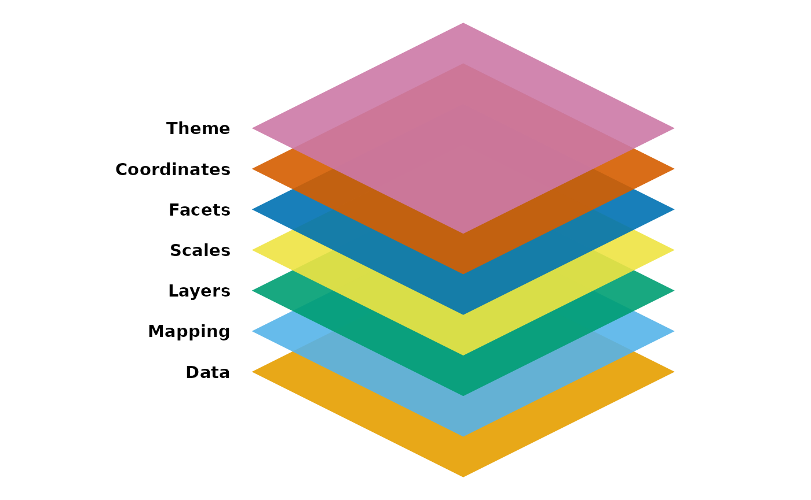
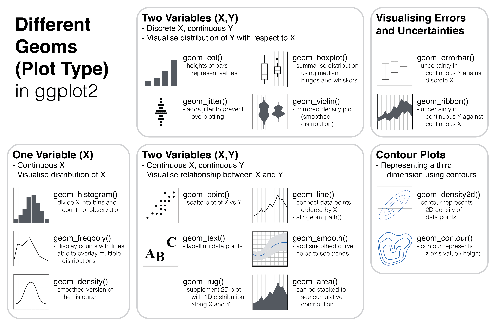

## What is ggplot2? {.smaller}

`ggplot2` is the most downloaded R library in the world

```{r}
#| message: false
library(ggplot2)
library(cranlogs)
library(scales)

ggplot_downloads_df <- cran_downloads("ggplot2", from = "2015-01-01", to = "2025-06-30")

g1 <- ggplot(ggplot_downloads_df, aes(x = date, y = count)) +
             geom_point(colour = "lightgrey") +
             scale_y_continuous(labels = label_number(suffix = "K", scale = 1e-3)) + # thousands
             geom_smooth() +
             labs(title = "ggplot2's rise in popularity over the past decade", 
             subtitle = "Number of daily downloads from CRAN",
             x = NULL,
             y = NULL) +
             theme_minimal() 
g1
             
```

## ggplot2 overview {.smaller}

-   Part of the `tidyverse` suite of packages, `ggplot2` offers great consistency with `dplyr` pipes and syntax ^[there is one very **notable exception**, which is the use of `+` instead of `%>%` to connect functions/verbs]

-   "gg" refers to "[The Grammar of Graphics](https://link.springer.com/book/10.1007/0-387-28695-0)," a 1999 book from Leland Wilkinson that provides a framework for creating statistical graphics in **layered components**

-   The "2" in `ggplot2` alludes to the fact that this package supplants an older library simply called `ggplot`, both developed by Hadley Wickham ^[the main function in `ggplot2` is still called `ggplot()`]

## Anatomy of a plot

[](https://ggplot2.tidyverse.org/articles/ggplot2.html)

## Getting started - Data

```{r}
#| echo: true  

tail(ggplot_downloads_df)
```

## Getting started - Plot {.smaller}

```{r}
#| echo: true  

library(ggplot2)

# ggplot2 needs the user to provide at least the following three components: 
# data, mapping, and layer

g2 <- ggplot(ggplot_downloads_df,          # Data
             aes(x = date, y = count)) +   # Mapping
             geom_point()                  # Layer

g2
```

## What makes for a good plot? {.smaller}

-   Easy to start with some minimally viable code for a plot, but how does one make a cleaner and more polished graph?

    -   Ironically, more lines of code are needed for a less cluttered plot

-   By utilizing rest of the components, one can add more features to the graph and also clean up unnecessary elements

-   Implement some good data visualization practices ^[Author Stephanie Evergreen has a 24-point checklist on [her website](https://stephanieevergreen.com/rate-your-visualization/), and a [previous presentation](https://raw.githack.com/najsaqib/naj_lab/main/data_viz_checklist.html) in the user group shows how to incorporate that in `ggplot2`]

## Polishing the plot - Adding another Geom {.smaller}

```{r}
#| echo: true
#| message: false
#| code-line-numbers: "4"

g3 <- ggplot(ggplot_downloads_df,          # Data
             aes(x = date, y = count)) +   # Mapping
             geom_point() +                # Layer
             geom_smooth()                 # Layer (additional)
  
g3
```

## Polishing the plot - Scaling layer {.smaller}

```{r}
#| echo: true
#| message: false
#| code-line-numbers: "1,7,8,9,10"

library(scales)

g4 <- ggplot(ggplot_downloads_df,          # Data
             aes(x = date, y = count)) +   # Mapping
             geom_point() +                # Layer
             geom_smooth() +               # Layer (additional)
             scale_y_continuous(
               labels = label_number(
                 suffix = "K", scale = 1e-3)
               )                           # Scale
  
g4
```

## Polishing the plot - Adding theme layer {.smaller}

```{r}
#| echo: true
#| message: false
#| code-line-numbers: "9"

g5 <- ggplot(ggplot_downloads_df,          # Data
             aes(x = date, y = count)) +   # Mapping
             geom_point() +                # Layer
             geom_smooth() +               # Layer (additional)
             scale_y_continuous(
               labels = label_number(
                 suffix = "K", scale = 1e-3)
               ) +                         # Scale
             theme_minimal()               # Theme
g5
```

## Polishing the plot - Specifying Labels {.smaller}

```{r}
#| echo: true
#| message: false
#| code-line-numbers: "10-13"

g6 <- ggplot(ggplot_downloads_df,          # Data
             aes(x = date, y = count)) +   # Mapping
             geom_point() +                # Layer
             geom_smooth() +               # Layer (additional)
             scale_y_continuous(
               labels = label_number(
                 suffix = "K", scale = 1e-3)
               ) +                         # Scale
             theme_minimal() +             # Theme
             labs(title = "ggplot2's rise in popularity over the past decade",
                  subtitle = "Number of daily downloads from CRAN",
                         x = NULL,
                         y = NULL)         # Labels
g6
```

## Polishing the plot - Modifying Colour {.smaller}

```{r}
#| echo: true
#| message: false
#| code-line-numbers: "3"

g7 <- ggplot(ggplot_downloads_df,          # Data
             aes(x = date, y = count)) +   # Mapping
             geom_point(colour = "lightgrey") + # Layer
             geom_smooth() +               # Layer (additional)
             scale_y_continuous(
               labels = label_number(
                 suffix = "K", scale = 1e-3)
               ) +                         # Scale
             theme_minimal() +             # Theme
             labs(title = "ggplot2's rise in popularity over the past decade",
                  subtitle = "Number of daily downloads from CRAN",
                         x = NULL,
                         y = NULL)         # Labels
g7
```

## From start to finish {.smaller}

```{r}
#| message: false
library(patchwork)

(g2 + g4) / 
(g5 + g7)
             
```

## Where to go from here? {.smaller}

::: incremental
-   Experiment with different types of graphs
-   Change default parameters
-   Learn how to incorporate `ggplot2` graphs in R Markdown/Quarto outputs
-   Implement reactive `ggplot2` objects within Shiny apps
-   Explore interactive plots via `ggiraph` or `ggplotly` packages
-   Compare and contrast `ggplot2` with base R or different libraries
-   Match Government of Canada look and feel
-   Make visuals colour-blind friendly and generally compliant with accessibility standards
:::

## Example plot types

[](https://ouyanglab.com/covid19dataviz/ggplot2.html)

## Resources {.smaller}

-   Official website: <https://ggplot2.tidyverse.org/index.html>

-   Cheat sheet: <https://github.com/rstudio/cheatsheets/blob/main/data-visualization.pdf>

-   Book of common plots: <https://r-graphics.org/>

-   Example graphs (includes non-`ggplot2` examples): <https://r-graph-gallery.com/>

-   Good data visualization practices by Stephanie Evergreen: <https://www.datavisualizationchecklist.com/>

-   Implementing Stephanie Evergreen checklist in `ggplot2`: <https://github.com/PHAC-RUG/presentations/blob/main/2021/ggplot_best_practices/data_viz_checklist.rmd>

-   Link to this document (Quarto Markdown): <https://github.com/PHAC-RUG/presentations/blob/main/2025/intro_ggplot2/intro_ggplot2.qmd>

-   Link to this document (HTML): <https://raw.githack.com/PHAC-RUG/presentations/main/2025/intro_ggplot2/intro_ggplot2.html>
